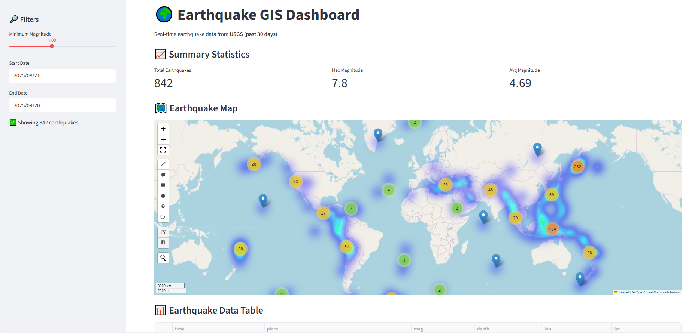

# 🌍 Earthquake GIS Dashboard

An **interactive Streamlit web app** for monitoring earthquakes worldwide using real-time data from the **United States Geological Survey (USGS)**. This dashboard allows users to **explore earthquake patterns** over the past 30 days (by default) or more, filter by magnitude and date, view **interactive maps, charts, and statistics**, and download filtered data for further analysis.

---

🌐 **Live Demo**: [Click here to explore](https://your-streamlit-url.streamlit.app)

Here’s the dashboard in action 👇  


---
## ✨ Key Features

🔹 **Interactive Map**
- Earthquake epicenters displayed as clustered markers
- Heatmap overlay to highlight earthquake hotspots
- Popups with details: location, magnitude, depth, date/time, and a link to USGS event page

🔹 **Filtering Options**
- Minimum magnitude selector (slider)
- Custom date range filter

🔹 **Summary Statistics**
- Total earthquakes (filtered)
- Maximum magnitude
- Average magnitude

🔹 **Data Exploration**
- Interactive data table (sortable and scrollable)
- Download filtered data as **CSV**

🔹 **Visualizations (Plotly)**
- 📈 Earthquakes over time (time series)
- 📊 Magnitude distribution (histogram)
- 🌊 Depth distribution (histogram)

---
## 📊 Data Source

The app fetches data directly from the **USGS Earthquake Hazards Program** in GeoJSON format:  
👉 [USGS Earthquake Feeds](https://earthquake.usgs.gov/earthquakes/feed/v1.0/geojson.php)

This dataset includes:
- Location (`lat`, `lon`)
- Magnitude
- Depth (in km)
- Place description
- Time (UTC)
- USGS event URL

---

## 🛠️ Tech Stack

- Frontend / Dashboard → Streamlit
- Mapping & GIS → Leafmap (based on Folium)
- Data Handling → Pandas, Requests
- Visualization → Plotly Express
- Data Source → USGS Earthquake Hazards Program (GeoJSON API)

---

## 📌 Use Cases

- Educational tool for learning about earthquakes and GIS visualization
- Quick disaster analysis for researchers, journalists, or students
- Monitoring seismic activity patterns worldwide
- Base project to extend into real-time geospatial dashboards

---

## 🚀 Installation & Running Locally

Clone the repository and run the dashboard with Streamlit:

```bash
# Clone repo
git clone https://github.com/your-username/earthquake-gis-dashboard.git
cd earthquake-gis-dashboard

# Install dependencies
pip install -r requirements.txt

# Run the app
streamlit run app.py
